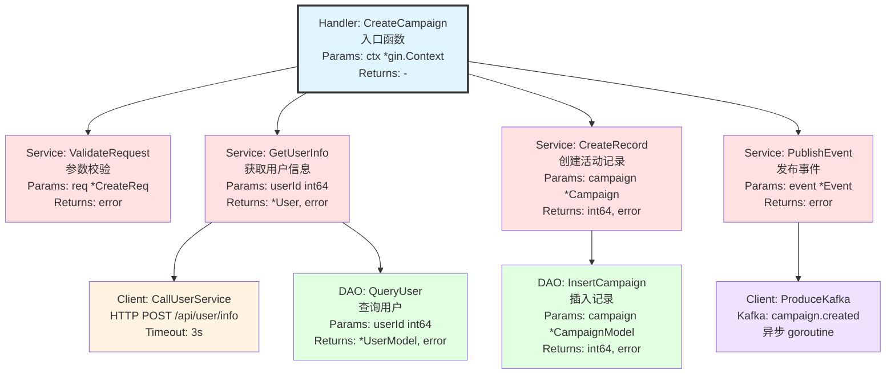
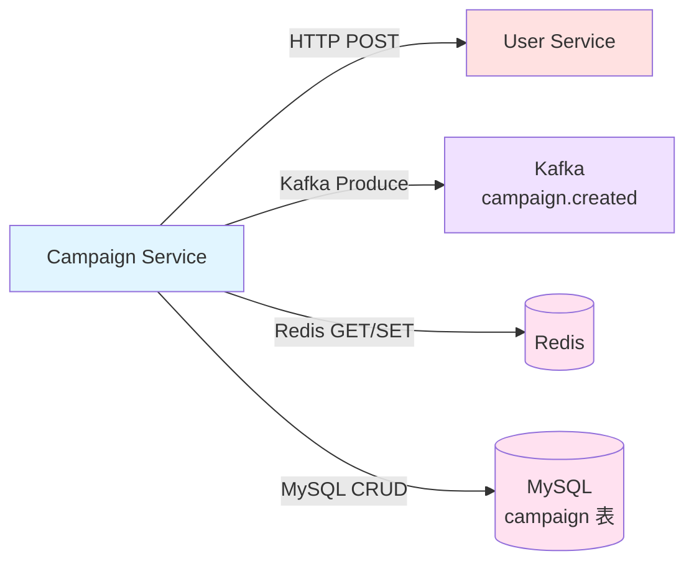
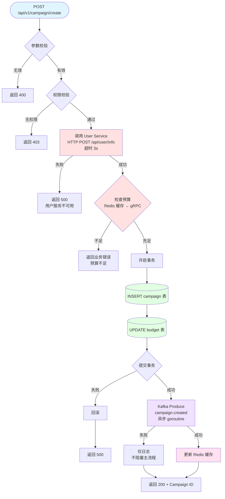

# Go Code Analyzer — 输出模板与示例

## 目录

1. [快速模式示例](#快速模式示例)
2. [标准模式示例](#标准模式示例)
3. [完整模式示例](#完整模式示例)
4. [Mermaid 配色规范](#mermaid-配色规范)
5. [不确定性文档示例](#不确定性文档示例)

---

## 快速模式示例

适用于分析单个函数或小范围代码。

### 输出格式

```markdown
## CreateOrder 调用链分析

### 调用层次

CreateOrder (Handler, internal/handler/order.go:45)
├── ValidateOrder (Service, internal/services/order/validate.go:23)
│   └── CheckUserStatus (Client→UserService, HTTP POST /api/user/status, timeout 3s)
├── InsertOrder (DAO, internal/dao/order/order.go:67)
│   └── MySQL INSERT orders 表，事务内
└── PublishOrderEvent (Service, internal/event/producer.go:34)
    └── Kafka Produce topic:order.created, 异步 goroutine

### 直接依赖

| 依赖 | 类型 | 接口 | 失败处理 |
|------|------|------|----------|
| User Service | HTTP POST | /api/user/status | 返回错误，中止流程 |
| MySQL | SQL | orders 表 INSERT | 事务回滚 |
| Kafka | Produce | order.created | 仅日志，不阻塞主流程 |
```

---

## 标准模式示例

适用于分析模块或目录级别代码。

### 1. 调用层次图 (graph TD)



### 2. 函数调用表

| 函数 | 层级 | 职责 | 调用 | 模式 | 备注 |
|------|------|------|------|------|------|
| CreateCampaign | Handler | 处理活动创建请求 | ValidateRequest, GetUserInfo, CreateRecord, PublishEvent | 同步 | 入口 |
| ValidateRequest | Service | 校验请求参数 | - | 同步 | |
| GetUserInfo | Service | 获取用户信息 | CallUserService, QueryUser | 同步 | 先查缓存 |
| CreateRecord | Service | 创建活动记录 | InsertCampaign | 同步 | 事务内 |
| PublishEvent | Service | 发布创建事件 | ProduceKafka | 异步 | goroutine |
| QueryUser | DAO | 查询用户数据 | - | 同步 | MySQL |
| InsertCampaign | DAO | 插入活动记录 | - | 同步 | MySQL |
| CallUserService | Client | 调用用户服务 | - | 同步 | HTTP POST, 3s |
| ProduceKafka | Client | 发送 Kafka 消息 | - | 异步 | topic: campaign.created |

### 3. 服务依赖图 (graph LR)



### 4. 服务依赖表

| 服务 | 方式 | 接口 | 用途 | 失败处理 | 超时 |
|------|------|------|------|----------|------|
| User Service | HTTP POST | /api/v1/user/info | 获取用户信息 | 返回错误，中止 | 3s |
| Kafka | Produce | campaign.created | 异步通知 | 仅日志 | N/A |
| Redis | GET/SET | campaign:info:{id} | 缓存活动信息 | 降级查 DB | 1s |
| MySQL | SQL | campaign 表 | 持久化数据 | 事务回滚 | 10s |

### 5. 入口点列表

**HTTP API**
- `POST /api/v1/campaign/create` → `CampaignHandler.CreateCampaign`
- `GET /api/v1/campaign/:id` → `CampaignHandler.GetCampaign`

**Kafka 消费者**
- `campaign.status.update` → `CampaignConsumer.HandleStatusUpdate`

**定时任务**
- `0 0 * * *` → `CampaignScheduler.CheckExpiredCampaigns`

---

## 完整模式示例

适用于服务级或 PR 全量分析。在标准模式基础上额外包含以下章节：

### 6. 核心业务流程描述

```markdown
活动创建流程：
1. 校验请求参数和用户权限
2. 调用用户服务获取用户信息（HTTP POST，3s 超时）
3. 检查预算余额（gRPC 调用，5s 超时）
4. 在事务中创建活动记录并扣减预算
5. 异步发布活动创建事件到 Kafka
6. 更新 Redis 缓存
```

### 7. 详细流程图 (flowchart TD)



### 8. 关键决策逻辑

| 决策点 | 条件 | 结果 | 代码位置 |
|--------|------|------|----------|
| 预算检查 | budget >= amount | 继续 / 返回错误 | services/budget/check.go:45 |
| 缓存策略 | Redis GET 命中 | 使用缓存 / 调用服务 | services/campaign/cache.go:23 |
| 事件发送失败 | Kafka 返回 error | 仅日志，主流程不受影响 | event/producer.go:67 |

### 9. 数据流

```
用户请求 → Handler(参数解析) → Service(业务校验) → Client(外部服务调用)
                                                   → DAO(数据库操作)
                                                   → Event(异步事件) → 响应
```

### 10. 错误处理机制

| 错误类型 | HTTP 状态码 | 处理方式 |
|----------|------------|----------|
| 参数无效 | 400 | 直接返回错误信息 |
| 未授权 | 403 | 中止流程 |
| 外部服务不可用 | 500 | 返回服务不可用错误 |
| 数据库事务失败 | 500 | 回滚事务，返回错误 |
| Kafka 发送失败 | - | 仅日志，不影响主流程 |

### 11. 待确认项

（见下方不确定性文档格式）

---

## Mermaid 配色规范

| 层级 | 颜色 | 色值 | 用途 |
|------|------|------|------|
| Handler（入口） | 蓝色 | `#e1f5ff` | 入口函数，加粗边框 `stroke-width:3px` |
| Service（业务） | 浅红 | `#ffe1e1` | 业务逻辑层 |
| DAO（数据访问） | 浅绿 | `#e1ffe1` | 数据库操作 |
| Client（外部调用） | 浅黄 | `#fff4e1` | HTTP/gRPC 外部服务 |
| 异步操作 | 浅紫 | `#f0e1ff` | goroutine/Kafka/异步 |
| 缓存/存储 | 浅粉 | `#ffe1f0` | Redis/MySQL 存储节点 |

**节点形状规范**：
- 矩形 `[text]`：普通步骤
- 菱形 `{text}`：决策分支
- 圆柱体 `[(text)]`：数据库操作
- 圆角矩形 `([text])`：起止点
- 平行四边形 `[/text/]`：输入/输出

---

## 不确定性文档示例

```markdown
## 待确认项

### 业务逻辑
1. **[需确认]** Kafka 消息发送失败后是否需要补偿机制？
   - 位置: `internal/event/producer.go:67`
   - 现状: 仅日志记录，不影响主流程
   - 建议: 评估消息丢失的业务影响

### 服务依赖
2. **[依赖不明确]** `NotifyUsers` 调用了未知 HTTP 接口
   - 位置: `internal/services/notify/sender.go:45`
   - 代码: `http.Post("http://unknown-service/api/send", ...)`
   - 建议: 确认目标服务名称和 API 文档

### 调用关系
3. **[调用关系不明确]** `HandleCallback` 被多个 goroutine 调用但无锁保护
   - 位置: `internal/handler/callback.go:56`
   - 风险: 潜在并发安全问题
   - 建议: 确认是否需要加锁或使用 channel
```
