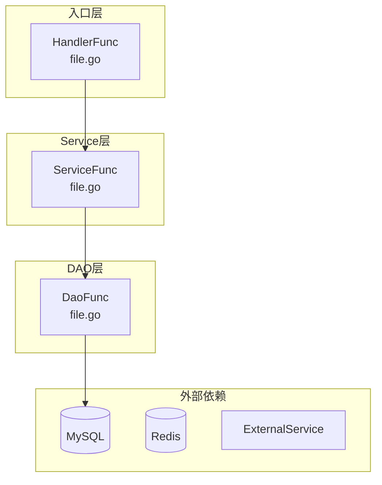
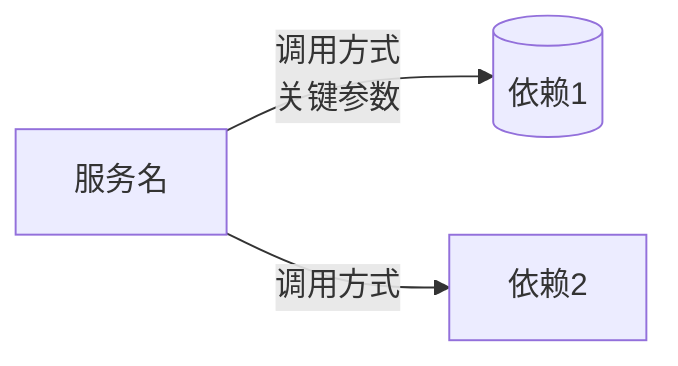
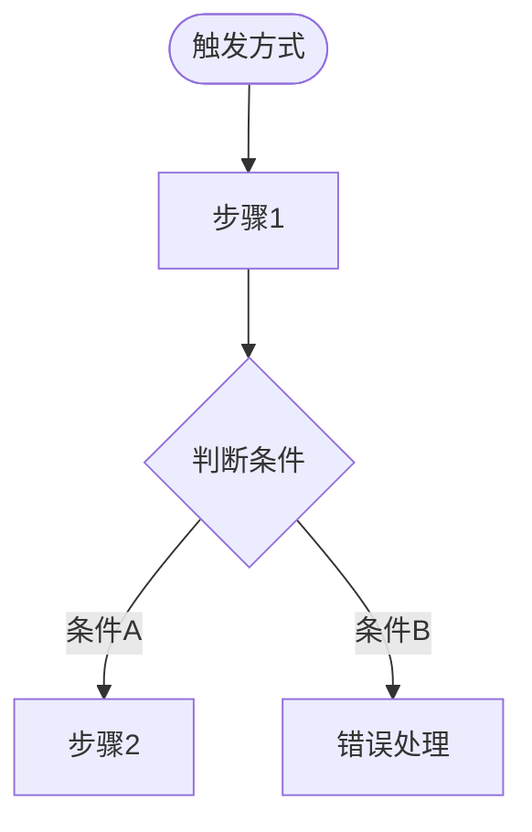
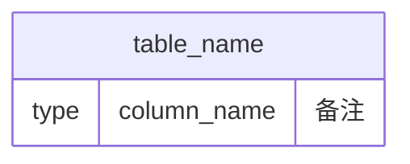

# 输出格式模板

本文件定义代码审核报告的标准输出格式。阶段8（报告生成）加载此模板来格式化最终输出。

---

## 严重程度定义

| 等级 | 标签 | 含义 | 标准 |
|------|------|------|------|
| 严重 | 🔴 严重 | 必须修复 | 存在崩溃、数据丢失、安全漏洞、业务逻辑错误风险 |
| 警告 | 🟡 警告 | 建议修复 | 存在潜在问题、不符合最佳实践、可能在特定条件下出错 |
| 建议 | 🔵 建议 | 可选优化 | 代码可以工作但有改进空间、风格建议、可读性提升 |

**分级原则：**
- 如果问题可能导致线上事故，标记为 🔴 严重
- 如果问题在特定条件下才会触发，或违反最佳实践但不会立即出错，标记为 🟡 警告
- 如果问题仅涉及代码风格、可读性或微小优化，标记为 🔵 建议

---

## 问题ID命名规范

格式：`{维度前缀}/{具体问题}`

### 维度前缀

| 前缀 | 维度 | 对应阶段 |
|------|------|----------|
| `style/` | 代码规范 | 阶段2 |
| `bug/` | 潜在bug | 阶段3 |
| `perf/` | 性能问题 | 阶段4 |
| `security/` | 安全漏洞 | 阶段5 |
| `arch/` | 架构设计 | 阶段6 |
| `business/` | 业务逻辑 | 阶段7 |

### 具体问题命名

使用小写英文短横线连接，简明描述问题本质：

- `bug/nil-pointer` — 空指针解引用
- `bug/goroutine-leak` — goroutine 泄漏
- `security/sql-injection` — SQL 注入
- `security/hardcoded-secret` — 硬编码密钥
- `perf/n-plus-one-query` — N+1 查询
- `perf/unnecessary-allocation` — 不必要的内存分配
- `arch/circular-dependency` — 循环依赖
- `business/missing-idempotency` — 缺少幂等性保护
- `style/unexported-return` — 导出函数返回未导出类型

同一维度下出现多个同类问题时，追加数字后缀：`bug/nil-pointer-2`

---

## 结构化摘要模板

报告开头使用以下摘要格式：

```
审核模式：{PR增量审核 | 全量代码审计}
审核范围：{文件列表或diff范围描述}
使用规则集：{general | microservice | cli | 自定义}
严格度分布：{各路径的严格度映射}

┌──────────┬────┐
│ 严重程度  │ 数量 │
├──────────┼────┤
│ 🔴 严重   │  N  │
│ 🟡 警告   │  N  │
│ 🔵 建议   │  N  │
└──────────┴────┘

按维度分布：
  代码规范: N | 潜在bug: N | 性能: N | 安全: N | 架构: N | 业务逻辑: N
```

**填写说明：**
- `审核模式`：根据输入是 diff/PR 还是完整代码目录决定
- `审核范围`：列出被审核的文件，或描述 diff 的 commit 范围
- `使用规则集`：从 review_rules.md 中加载的规则集名称
- `严格度分布`：如 `internal/ → normal, api/ → strict`
- 数量统计：汇总所有阶段发现的问题，按严重程度和维度分别计数
- 如果某个维度数量为 0，仍然显示为 0，不要省略

---

## 架构分析图表（go-code-analyzer 输出）

在结构化摘要之后、问题列表之前，必须插入阶段1中 go-code-analyzer 产出的架构分析，以 Mermaid 图表形式呈现。包含以下 5 个部分：

### 1. 入口点列表

使用表格格式列出所有新增或修改的入口点：

```
### 入口点列表

| 类型 | 触发方式 | 入口函数 | 说明 |
|------|----------|----------|------|
| MQ消费者 | Kafka: {topic/group} | `HandlerFunc` → `ServiceFunc` | 功能描述 |
| 定时任务 | Cron: `{cron表达式}` | `ScheduleFunc` → `TaskFunc` | 功能描述 |
| HTTP API | {METHOD} {path} | `Handler.Method` | 功能描述 |
| 手动任务 | CLI task | `TaskFunc` | 功能描述 |
```

### 2. 函数调用层级图

使用 Mermaid `graph TD`，按层分 subgraph（入口层、Service层、DAO层、外部依赖），节点标注函数名和文件名：

````
### 函数调用层级图


````

**图表要求：**
- 按层分 subgraph，层内节点按调用顺序排列
- 节点格式：`[函数名<br/>文件名]`
- 核心函数（如协调器、关键计算）使用醒目样式（`style NodeID fill:#fff4e1,stroke:#f90,stroke-width:3px`）
- 锁相关节点使用红色系样式
- 外部依赖使用对应颜色区分（MySQL绿色、Redis红色、MQ黄色、外部服务紫色）
- 节点数超过 50 时拆分为多张图

### 3. 服务依赖图

使用 Mermaid `graph LR`，标注调用方式和关键参数：

````
### 服务依赖图


````

**图表要求：**
- 边标签标注调用方式（HTTP/gRPC/SQL/Redis命令等）和关键参数（超时、TTL、批量大小等）
- 区分同步/异步调用（异步用虚线 `-.->` ）

### 4. 核心业务流程图

为每个关键入口点生成一张 Mermaid `flowchart TD`，包含所有分支和错误处理路径：

````
### 核心流程图：{流程名称}


````

**图表要求：**
- 使用标准形状：圆角矩形`([...])`表示起止、矩形`[...]`表示步骤、菱形`{...}`表示判断、圆柱`[(...)]`表示数据库操作
- 标注外部服务调用（服务名、接口、超时）
- 标注关键业务规则和阈值
- 错误路径和正常路径使用不同颜色
- 单张图节点不超过 50 个，超过时拆分为子流程

### 5. 数据库表关系图

使用 Mermaid `erDiagram`，仅包含本次变更涉及的表：

````
### 数据库表关系图


````

**图表要求：**
- 仅包含本次变更新增或修改的表
- 新增表和新增字段添加 `"新增表"` / `"新增字段"` 备注
- 标注表间关系（外键、业务关联）

---

## 逐条详细评论模板

每个发现的问题使用以下格式输出：

```
[{严重程度标签}] {问题ID}
文件：{file_path}:{line_number}
阶段：阶段{N} - {阶段名称}
代码：
  {相关代码片段，标注问题位置}
问题：{问题描述，说明为什么这是个问题}
建议：{修复建议，尽可能给出具体代码示例}
```

### 填写示例

```
[🔴 严重] bug/nil-pointer
文件：internal/service/order.go:142
阶段：阶段3 - 潜在bug扫描
代码：
  func (s *OrderService) GetOrder(ctx context.Context, id string) (*Order, error) {
      order, err := s.repo.FindByID(ctx, id)
      // err 未检查，order 可能为 nil
      return order.ToDTO(), nil  // ← 此处可能 panic
  }
问题：FindByID 返回的 error 未被检查，当查询失败时 order 为 nil，调用 order.ToDTO() 将触发 nil pointer panic。
建议：
  order, err := s.repo.FindByID(ctx, id)
  if err != nil {
      return nil, fmt.Errorf("查询订单失败: %w", err)
  }
  if order == nil {
      return nil, ErrOrderNotFound
  }
  return order.ToDTO(), nil
```

### 格式要求

- `代码` 字段：引用实际代码，用注释 `// ←` 标注问题位置
- `问题` 字段：解释问题的根因和影响，不要只描述现象
- `建议` 字段：给出可直接采用的修复代码；如果修复方案不唯一，列出首选方案并简述替代方案
- 如果问题涉及业务意图不明确，在问题描述末尾追加 `[业务意图不明确]` 标记

---

## 报告末尾总结模板

```
## 总结

**整体评价：** {一句话概括代码质量}

**最需关注的问题：**
1. {Top 1问题简述及位置}
2. {Top 2问题简述及位置}
3. {Top 3问题简述及位置}

**需人工确认项：**（如有[业务意图不明确]标记）
- {文件:行号} — {不明确的业务意图描述}
```

### 填写说明

- `整体评价`：一句话，客观描述代码质量水平和主要风险点
- `最需关注的问题`：按严重程度排序，取前3个最重要的问题；如果严重问题不足3个，用警告级别补充
- `需人工确认项`：汇总所有带 `[业务意图不明确]` 标记的问题；如果没有此类问题，省略整个小节
- 如果审核未发现任何问题，总结中说明"未发现问题"并简要肯定代码质量

---

## 无问题时的输出格式

当审核未发现任何问题时，使用简化格式：

```
审核模式：{PR增量审核 | 全量代码审计}
审核范围：{文件列表或diff范围描述}
使用规则集：{general | microservice | cli | 自定义}

未发现问题。

## 总结

**整体评价：** {对代码质量的简要肯定}
```
