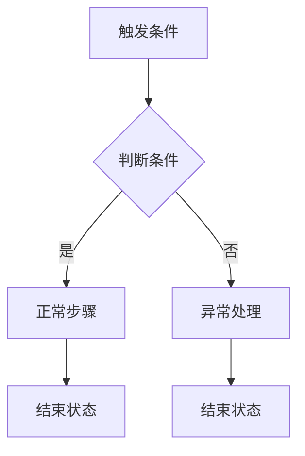

# 需求转设计

从结构化产品需求到完整技术设计文档，由项目知识库驱动。

## 前置检查

1. 验证项目根目录下是否存在 `knowledge/` 目录
   - 不存在 → 告知用户需先构建知识库，停止流程
2. 读取 `references/glossary.md` — 加载业务术语表
3. 确定主题标识 `<topic>`：从需求标题或用户描述中提取简短英文标识（如 `deposit-campaign`、`invite-reward`），用于缓存目录命名

> **硬性禁令：主 Agent 严禁读取 `references/kb_indexes.md`。** 任何阶段、任何理由（包括前置检查、缓存构建等）主 Agent 均不得读取该文件。此规则优先级最高，不可被其他规则覆盖。子 Agent 不受此限制。

## 确认循环（全局规则）

每个阶段的输出都进入开放式确认循环：

```
输出结果 → 询问是否需要调整
  → 用户提出问题 → 修订并重新输出 → 再次询问（无限循环）
  → 用户确认无问题 → 进入下一阶段
```

绝不跳过确认。绝不自动推进。用户掌控节奏。

### 红线：必须获得显式确认

**禁止在用户未明确确认的情况下进入下一阶段。** 这是不可违反的硬性规则。

判定"用户已确认"的唯一标准：用户消息中必须包含"**确认**"二字。

> 仅接受：确认

**其他任何词汇（包括但不限于：没问题、没错、OK、ok、好的、可以、通过、同意、正确、对的、继续、LGTM、lgtm、approved、confirm、yes、是的、行）均不视为确认，必须提示用户明确回复"确认"。**

**违规场景（全部禁止）：**

- 用户只是提问或讨论 → 不算确认，禁止推进
- 用户沉默或发送空消息 → 不算确认，禁止推进
- 用户回复了新内容但未含确认词 → 不算确认，禁止推进
- AI 自行判断"用户应该没意见了" → 禁止，必须等待显式确认
- **系统输入（`<system-reminder>`、工具返回结果、自动注入的上下文等）→ 绝对不算用户确认，禁止推进。只有来自人类用户的显式消息才能构成确认。**

**未收到确认时的唯一合法动作：** 再次询问用户是否确认当前阶段的输出。

**严格的步骤门控规则：** 每一步必须等待用户的显式确认后才能进入下一步。此规则无任何例外。AI 在输出当前阶段结果后，必须停止并等待，不得以任何理由（包括效率、上下文连贯性等）跳过等待。

> **后续各阶段提到"进入确认循环"时，均指上述完整规则，不再重复。**

## 上下文窗口管理（全局规则）

本流程涉及大量知识文件读取和多轮对话，上下文窗口**必然**在中后期被压缩。以下规则确保信息不丢失。

### 核心原则：缓存即真相

**对话上下文是易失的，缓存文件是持久的。** 任何需要在后续阶段使用的信息，必须写入缓存文件。不得依赖"对话上下文中还保留着之前的内容"这一假设。

### 委派-汇总-写缓存 模式

阶段 3 的知识库查询通过子 Agent 完成，主 Agent 执行三步操作：

```
1. 委派 → 并行派发子 Agent（使用 campaign-kb skill）查询各业务域
   子 Agent 返回结构化结果，包含：
   - 接口签名（方法名 + 参数 + 返回值）
   - 表结构（表名 + 关键字段 + 索引）
   - 依赖关系（调用的服务 + Wire 注入）
   - 模式/惯例（命名规范、路由前缀、错误码范围）
2. 汇总 → 合并所有子 Agent 结果，去重、检查完整性
3. 写缓存 → 将汇总结果写入 kb-scan.md 缓存文件
```

**禁止：** 子 Agent 返回结果后仅在对话中讨论，而不将关键信息固化到缓存。

### 缓存自包含要求

每个阶段的缓存文件必须满足**自包含性**：仅凭该文件（加上前序阶段的缓存文件），即可完成后续阶段的全部工作，**无需重新读取任何 knowledge/ 原文件**。

自包含检查清单：

| 缓存文件 | 必须包含的细节（非仅结论） |
|----------|--------------------------|
| `kb-scan.md` | 每个已读模块的关键接口签名、表结构摘要、Wire 注入点、命名惯例 |
| `impact-analysis.md` | 具体的字段定义（类型+约束）、具体的方法签名、具体的路由路径 |
| `design-draft.md` | 完整的设计内容，不引用"见 kb-scan.md 中的 xxx" |

### 并行子 Agent 委派策略

阶段 3 的知识库扫描通过**并行子 Agent**（使用 `campaign-kb` skill）完成，主 Agent 不直接读取知识文件：

```
主 Agent 分析业务流程 → 拆分为 N 个独立查询任务
  → 并行派发 N 个子 Agent（各自使用 campaign-kb skill）
  → 每个子 Agent 独立查询并返回结构化结果
  → 主 Agent 汇总所有子 Agent 结果 → 写入 kb-scan.md 缓存
```

**优势：**
- 子 Agent 的知识文件读取不占用主 Agent 的上下文窗口
- 并行执行大幅缩短扫描时间
- 每个子 Agent 聚焦单一业务域，查询更精确

### 上下文压力预警

当 AI 感知到以下信号时，必须主动告知用户：

- 当前对话轮次已超过 **20 轮**
- 需要读取的知识文件超过 **8 个**
- 单个阶段的对话已超过 **10 轮**（可能因反复修改）

预警时建议用户：
1. 确认当前阶段并写入缓存
2. 开启新对话，从缓存恢复继续

## 缓存机制

### 目录结构

所有中间结果缓存在 `.design-cache/<topic>/` 下，使用语义文件名：

```
.design-cache/<topic>/
├── flowcharts.md        # 阶段 2: 功能点清单 + 业务流程图
├── kb-scan.md           # 阶段 3: 知识库扫描结果
├── impact-analysis.md   # 阶段 4: 影响分析结果
└── design-draft.md      # 阶段 5: 设计文档增量草稿
```

### 校验头

每个缓存文件头部必须包含校验块：

```markdown
> topic: <topic>
> req_source: <需求文档路径或描述的前 50 字>
> generated: YYYY-MM-DD HH:MM
```

### 恢复规则

当新对话尝试从中间阶段继续时：
1. 检测 `.design-cache/<topic>/` 下对应缓存文件是否存在
2. 展示校验头中的 `topic` 和 `req_source`，让用户确认是否匹配当前需求
3. 匹配 → 展示缓存摘要 → 进入 **确认循环** → 通过后从下一阶段开始
4. 不匹配 → 提示用户是否清除旧缓存重新开始

### 写出时机

| 时机 | 写入文件 | 方式 |
|------|----------|------|
| 阶段 2 确认通过后 | `flowcharts.md` | 全量写入 |
| 阶段 3 全部确认通过后 | `kb-scan.md` | 全量写入 |
| 阶段 4 全部确认通过后 | `impact-analysis.md` | 全量写入 |
| 阶段 5 每个批次确认后 | `design-draft.md` | 增量追加（不覆盖已确认批次） |

## 回退指令

用户可在任意阶段说 **"回到阶段 N"** 触发回退：

1. AI 列出将要清除的缓存文件（目标阶段之后的所有缓存）
2. 进入 **确认循环** — 用户回复"确认"后执行清除
3. 从目标阶段重新开始

回退映射：

| 回退到 | 清除的缓存 |
|--------|-----------|
| 阶段 1 | flowcharts.md + kb-scan.md + impact-analysis.md + design-draft.md |
| 阶段 2 | flowcharts.md + kb-scan.md + impact-analysis.md + design-draft.md |
| 阶段 3 | kb-scan.md + impact-analysis.md + design-draft.md |
| 阶段 4 | impact-analysis.md + design-draft.md |
| 阶段 5 | design-draft.md |

## 工作流程

### 阶段 1：需求理解

读取用户提供的需求文档，一次完成内容核实和要点提取：

1. 如果内容存在明显截断、乱码或格式异常，主动标注告警
2. 输出需求摘要：
   - 原文关键段落引用（非全文复制，选取核心部分）
   - 业务目标
   - 功能范围
   - 约束条件
3. 进入 **确认循环**

### 阶段 2：业务流程图

基于阶段 1 确认的需求理解，总结功能点并规划业务流程图。

**缓存恢复：** 如果当前对话上下文中不包含阶段 2 的输出，检测并恢复 `.design-cache/<topic>/flowcharts.md`。

**第一步：功能点总结与流程图规划**

从需求中梳理出所有功能点，然后分析这些功能点之间的关系，规划需要生成几张流程图。输出格式：

```
## 功能点清单
1. <功能点名称> — 一句话描述
2. <功能点名称> — 一句话描述
...

## 流程图规划
需要生成 N 张流程图：

图 1：<流程图名称>
  覆盖功能点：1, 3, 5
  理由：<为什么这些功能点属于同一条业务流程>

图 2：<流程图名称>
  覆盖功能点：2, 4
  理由：<...>
```

规划原则：
- 属于同一用户旅程或同一业务主线的功能点，合并到一张图
- 独立触发、独立完成的功能点，单独一张图
- 流程间有上下游关系但可独立理解的，分开画
- **新增业务逻辑必须有流程图**：如果需求涉及新增的业务逻辑（而非仅修改现有逻辑或配置变更），必须为其规划专门的流程图，展示完整的处理链路和判断分支

进入 **确认循环** — 用户可能要求调整功能点、合并/拆分流程图、或修改分组方式。

**第二步：生成流程图**

按已确认的规划，一次性输出所有流程图。

每张流程图须包含：

- **触发条件**：用户操作或系统事件（作为起始节点）
- **主流程**：正常路径的完整步骤链
- **判断分支**：菱形节点标注判断条件（如资格校验通过/不通过、金额是否达标）
- **异常/边界路径**：失败、超时、不满足条件等异常流向
- **终止状态**：明确的结束节点（成功结果 / 失败结果）

Mermaid 输出规范：



- 使用 `flowchart TD`（自顶向下）
- 节点 ID 使用有意义的缩写（如 `chkElig` 而非 `A`、`B`）
- 判断节点用 `{}` 菱形
- 每张图控制在 15-30 个节点内，超过则拆分为子流程

进入 **确认循环** — 用户可能要求调整流程、补充分支或修改节点描述。

**阶段 2 缓存写出（必须执行）：**

当功能点清单、流程图规划和所有流程图全部确认通过后，写入 `.design-cache/<topic>/flowcharts.md`：

```markdown
# 业务流程图
> topic: <topic>
> req_source: <需求文档路径或描述的前 50 字>
> generated: YYYY-MM-DD HH:MM

## 功能点清单
1. <功能点名称> — 一句话描述
2. ...

## 流程图 1：<名称>
覆盖功能点：1, 3, 5
<Mermaid 代码块>

## 流程图 2：<名称>
覆盖功能点：2, 4
<Mermaid 代码块>

...
```

写出后告知用户：缓存已保存，可在新对话中从阶段 3 继续。

### 阶段 3：知识库扫描（子 Agent 并行委派）

**缓存恢复：** 如果当前对话上下文中不包含前序阶段输出，依次检测并恢复：
- `.design-cache/<topic>/flowcharts.md`
- `.design-cache/<topic>/kb-scan.md`

本阶段通过**并行子 Agent**（使用 `campaign-kb` skill）完成知识库扫描，主 Agent 不直接读取 knowledge/ 文件。

**第一步：任务拆分与查询规划**

主 Agent 分析阶段 2 已确认的业务流程图和功能点清单，识别涉及的业务域和技术关注点，拆分为独立的知识查询任务。输出格式：

```
## 子 Agent 查询任务规划

需要派发 N 个子 Agent：

任务 1：<业务域/关注点名称>
  查询目标：<需要了解什么>
  campaign-kb 查询要点：
    - <具体问题 1>（如：奖励发放的服务接口和方法签名）
    - <具体问题 2>（如：奖励相关的数据表结构）
    - <具体问题 3>（如：奖励模块的 Wire 注入和依赖关系）

任务 2：<业务域/关注点名称>
  查询目标：<...>
  campaign-kb 查询要点：
    - <...>

任务 N（固定）：基础设施模式
  查询目标：MQ 消费者注册方式、HTTP 路由前缀规范、定时任务模式、相关 Kafka Topic
  campaign-kb 查询要点：
    - 现有 MQ 消费模式和 consumer group 注册方式
    - HTTP 路由前缀规范
    - 定时任务注册模式（如涉及）
    - 相关 Kafka Topic 定义（如涉及消息）
```

拆分原则：
- **按业务域拆分**：每个子 Agent 负责一个独立的业务域（如奖励、用户、活动、积分等）
- **查询内容完整**：每个任务须同时涵盖该业务域的模块职责（L3）、数据模型（L4）、服务契约（L5）
- **固定包含基础设施任务**：最后一个任务始终查询基础设施模式（L3/infra + event_catalog）
- **避免重叠**：不同任务查询的业务域不重叠

进入 **确认循环** — 用户可能要求调整任务拆分、增删查询要点。

**第二步：并行派发子 Agent**

用户确认查询规划后，使用 Agent 工具**在一条消息中并行派发所有子 Agent**。每个子 Agent 的 prompt 模板：

```
你是 campaign 项目的知识库查询专家。请使用 campaign-kb skill（/kb）回答以下查询。

## 查询背景
当前正在为「<需求标题>」进行技术设计，需要了解以下业务域的技术细节。

## 查询要点
<从任务规划中复制该任务的查询要点列表>

## 输出要求（严格遵守）
请按以下结构化格式返回结果，确保信息完整：

### 模块知识
- 职责：<一句话>
- 核心接口（必须包含完整签名：方法名 + 参数类型 + 返回值类型）：
  - `InterfaceName.MethodA(param1 Type1, param2 Type2) (ReturnType, error)` — 用途
- Wire 注入：`ProviderSet` 位于 `<路径>`，注入 `<依赖列表>`
- 依赖的服务：<服务名列表>
- 命名惯例：<路由前缀 / 表名前缀 / 错误码范围>

### 数据模型
对每个相关表：
- 表名：<table_name>
- 用途：<一句话>
- 关键字段（必须包含类型和约束）：
  | 字段名 | 类型 | 约束 | 说明 |
  |--------|------|------|------|
  | ... | ... | ... | ... |
- 索引：<索引定义>

### 服务契约
- `MethodA(ctx context.Context, param1 Type1) (*Result, error)` — 用途
（方法签名必须完整，不可省略参数和返回值）

### 来源文件
- 列出本次查询引用的所有 knowledge/ 文件路径
```

**子 Agent 配置：**
- `subagent_type`: `general-purpose`
- 每个子 Agent 使用 `campaign-kb` skill 进行查询
- 所有子 Agent **并行启动**（在同一条消息中发起多个 Agent 调用）

**第三步：结果汇总与审查**

所有子 Agent 返回后，主 Agent：

1. **汇总结果**：将各子 Agent 的返回按统一格式整理
2. **去重合并**：不同子 Agent 可能引用了同一模块/表/服务，合并重复内容
3. **完整性检查**：
   - 每个接口签名是否包含完整参数和返回值？缺失则标注 `[签名不完整，需补查]`
   - 每个数据表是否包含关键字段的类型和约束？缺失则标注 `[字段信息不完整，需补查]`
   - 是否所有业务流程涉及的模块都已覆盖？遗漏则标注 `[需补充查询]`
4. **补查**（如需要）：对标注了不完整的内容，可追加派发子 Agent 进行定向补查
5. **输出汇总结果 + "可复用的现有能力 + 需要新建的能力"结论**

进入 **确认循环** — 用户可能要求补充查询、修正结论。

**阶段 3 缓存写出（必须执行）：**

当阶段 3 的所有确认循环全部通过后，**必须**将以下内容写入 `.design-cache/<topic>/kb-scan.md`：

1. 阶段 1 的需求理解摘要（业务目标、功能范围、约束条件）
2. 已确认的相关模块清单（含文件路径和选取理由）
3. 已读取的知识文件内容摘要（每个文件的关键信息）
4. "可复用的现有能力 + 需要新建的能力"结论

文件格式（**必须包含完整的提取细节，而非仅结论性摘要**）：

```markdown
# 知识库扫描结果
> topic: <topic>
> req_source: <需求文档路径或描述的前 50 字>
> generated: YYYY-MM-DD HH:MM

## 需求理解摘要
- 业务目标：<...>
- 功能范围：<...>
- 约束条件：<...>

## 相关模块清单
| 模块 | 文件路径 | 选取理由 |
|------|----------|----------|
| xxx  | knowledge/L3_modules/... | <理由> |

## 模块知识提取
### <模块名 1>（来源：<文件路径>）
- 职责：<一句话>
- 核心接口：
  - `InterfaceName.MethodA(param1 Type1, param2 Type2) (ReturnType, error)` — 用途
  - `InterfaceName.MethodB(...)` — 用途
- Wire 注入：`ProviderSet` 位于 `<路径>`，注入 `<依赖列表>`
- 依赖的服务：<服务名列表>
- 命名惯例：<路由前缀 / 表名前缀 / 错误码范围>

### <模块名 2>（来源：<文件路径>）
...

## 数据模型提取
### <表名 1>（来源：<文件路径>）
- 用途：<一句话>
- 关键字段：
  | 字段名 | 类型 | 约束 | 说明 |
  |--------|------|------|------|
  | id | int64 | PK, auto_increment | 主键 |
  | ... | ... | ... | ... |
- 索引：<索引定义>
- 分表策略：<如有>

### <表名 2>（来源：<文件路径>）
...

## 服务契约提取
### <服务接口名 1>（来源：<文件路径>）
- `MethodA(ctx context.Context, param1 Type1) (*Result, error)` — 用途
- `MethodB(...)` — 用途

### <服务接口名 2>（来源：<文件路径>）
...

## 基础设施模式提取
- MQ 消费模式：<从 L3/infra 提取的消费者注册方式>
- HTTP 路由前缀：<已有的路由前缀规范>
- gRPC 模式：<如涉及>
- 定时任务模式：<如涉及>
- 相关 Kafka Topic：<从 event_catalog 提取>

## 能力分析结论
### 可复用的现有能力
- <能力描述> — 来自 `<模块名>`，接口 `<方法签名>`
### 需要新建的能力
- <能力描述> — 理由：<为什么现有服务不能满足>
```

> **自包含校验：** 写出前检查 — 仅凭此文件，能否回答以下问题？
> 1. 新功能应该依赖哪些现有接口？（需要具体方法签名，不能只有模块名）
> 2. 新表应该怎么命名？（需要命名惯例，不能只说"参考 L4"）
> 3. 新 API 路由前缀是什么？（需要具体前缀，不能只说"参考 L3/infra"）
> 4. Wire Provider 应该注册在哪里？（需要具体文件路径）
>
> 如果任何一项需要回头读 knowledge/ 原文件才能回答，说明自包含性不足，需补充。

写出后告知用户：缓存已保存，可在新对话中从阶段 4 继续。

### 阶段 4：影响分析

**缓存恢复：** 如果当前对话上下文中不包含阶段 3 的输出，检测并恢复 `.design-cache/<topic>/kb-scan.md`，展示摘要后进入确认循环。

逐维度分析，每个维度单独进入 **确认循环**：

- 数据模型影响（新表 / 新字段 / 索引 / 分片）
- 服务层影响（复用 / 新建 / 修改服务）
- 接口层影响（API / MQ / 定时任务 / gRPC）
- 上下游依赖影响

**阶段 4 缓存写出（必须执行）：**

当 4 个维度全部确认通过后，**必须**将影响分析结论写入 `.design-cache/<topic>/impact-analysis.md`：

```markdown
# 影响分析结果
> topic: <topic>
> req_source: <需求文档路径或描述的前 50 字>
> generated: YYYY-MM-DD HH:MM

## 数据模型影响
<已确认内容>

## 服务层影响
<已确认内容>

## 接口层影响
<已确认内容>

## 上下游依赖影响
<已确认内容>
```

写出后告知用户：缓存已保存，可在新对话中从阶段 5 继续。

### 阶段 5：设计输出

**缓存恢复：** 如果当前对话上下文中不包含阶段 4 的输出，依次检测并恢复：
- `.design-cache/<topic>/kb-scan.md` — **这是阶段 5 的核心输入**，包含所有接口签名、表结构、命名惯例等细节
- `.design-cache/<topic>/impact-analysis.md`
- `.design-cache/<topic>/design-draft.md`（如存在，说明部分批次已完成，跳到未完成的批次）

**阶段 5 不再读取 knowledge/ 原文件。** 所有设计决策所需的知识库信息应已包含在 `kb-scan.md` 和 `impact-analysis.md` 中。如果发现缓存中缺少关键信息（如某个接口签名缺失），先补充缓存，再继续设计。

读取 `references/design_template.md`。按 **4 个批次** 输出，每批次进入 **确认循环**：

**批次 A — 架构与流程**
1. 概述与背景
2. 架构决策
3. 核心流程设计（引用阶段 2 已确认的业务流程图，在此基础上补充系统层面的时序图和交互细节）

**批次 B — 数据与服务**
4. 数据模型设计
5. 服务层设计
6. 接口设计

**批次 C — 质量保障**
7. 并发与一致性
8. 错误处理
9. 监控与可观测性

**批次 D — 运维落地**
10. 配置变更
11. 代码变更清单
12. 上线与回滚
13. 风险与注意事项

如某章节不适用于当前需求，标记为"不适用"并说明原因。

**每批次确认后，立即将该批次内容追加到 `.design-cache/<topic>/design-draft.md`。** 文件头部仅在首次写入时创建：

```markdown
# 设计文档草稿
> topic: <topic>
> req_source: <需求文档路径或描述的前 50 字>
> generated: YYYY-MM-DD HH:MM
> last_batch: <最近完成的批次字母，如 B>
```

后续批次追加到文件末尾，并更新 `last_batch` 标记。

### 阶段 6：文档定稿

- 汇总所有已确认的章节（从 `design-draft.md` 读取或从当前上下文获取）
- 将阶段 2 的业务流程图嵌入到最终文档的"核心流程设计"章节中
- 写入 `docs/plans/YYYY-MM-DD-<topic>-design.md`
- 询问用户是否需要 git commit
- 完成后可选择清除 `.design-cache/<topic>/` 目录

## 知识库使用指南

### 阶段 3：子 Agent 通过 campaign-kb skill 查询

阶段 3 的知识库访问完全委派给子 Agent，主 Agent **不直接读取 knowledge/ 文件**。

子 Agent 查询时遵循 campaign-kb skill 的内置优先级：
```
kb_indexes.md（子 Agent 自动加载）
  → L3 模块文件（先定位相关模块，含职责/流程/依赖/Wire注入）
    → L4 表文件（如需数据模型变更）
    → L5 服务文件（如需服务层变更，纯方法签名）
    → L3/infra 文件（如需了解 API/MQ/定时任务模式）
    → L5/event_catalog.md（如涉及 Kafka 消息）
```

主 Agent 只需在 prompt 中明确查询要点，campaign-kb skill 会自动选择合适的知识层。

### 知识文件生命周期

```
阶段 3 子 Agent 通过 campaign-kb 查询 knowledge/ → 返回结构化结果
                                                        ↓
主 Agent 汇总 → 写入 kb-scan.md 缓存
                        ↓
阶段 4-6 仅从缓存工作 ← ┘
（不再读取 knowledge/ 原文件）
```

knowledge/ 原文件仅在阶段 3 由子 Agent 读取。阶段 4 及之后的所有工作**只依赖缓存文件**。
如果阶段 5 发现缓存中缺少某个关键细节，应：
1. 明确告知用户缺少什么信息
2. 派发一个子 Agent 使用 campaign-kb skill 针对性查询缺失内容
3. 将查询结果补充到 `kb-scan.md` 缓存中
4. 再继续设计工作

## 输出质量规则

### 基础规则

- 架构决策必须引用 L3 中的现有模块模式
- 新表设计必须遵循 L4 中的命名规范
- 服务接口必须遵循 L5 中的 `I*SRV` 模式
- API 路由必须遵循 L3/infra 中的现有前缀规范
- 代码变更清单必须包含 Wire Provider 注册变更
- 多区域功能需考虑 primary/us 构建标签差异
- 业务流程图必须使用 Mermaid flowchart / sequence diagram 语法，禁止纯文本缩进

### 阶段 6 定稿前：交叉一致性校验（必须执行）

在将设计文档写入 `docs/plans/` 之前，逐项检查以下一致性规则。如有不一致，修正后再定稿。

| 校验项 | 规则 | 典型违规 |
|--------|------|----------|
| §2 目录结构 ↔ §11 代码变更清单 | 文件路径完全对齐，不可出现一方有另一方没有的文件 | §2 service/ 列了 5 个文件，§11 列了 6 个 |
| §3 流程中的方法名 ↔ §5 接口定义 | 流程图中调用的方法必须在 §5 有对应签名 | 流程写"批量发放"但接口签名是单个发放 |
| §5 复用服务 ↔ 实际方法签名 | 列出的复用服务必须包含完整方法签名（参数+返回值），不能只写服务名+用途 | `IAwardSRV` 只写了"批量发奖"，未贴签名 |
| §7 幂等声明 ↔ §4 约束定义 | 声称"唯一键防重"必须在 §4 中有对应的唯一约束；若表上无此约束，§4 必须新增 | §7 声称唯一键防重但 §4 未列出该约束 |
| §4 复用表 ↔ 字段语义映射 | 复用已有表必须列出字段清单和本业务语义映射 | "复用 ca_task_enter_record"但不说明哪些字段存什么值 |
| §8 错误码 ↔ 全局冲突 | 错误码须声明命名空间/分配范围，说明不与现有模块冲突 | 直接用 40001 但不确认是否被占用 |
| §6 MQ 消费 ↔ 现有 handler | 新增 handler 须说明 consumer group 是新建还是复用，同一 topic+msgType 的现有 handler 列表 | 声称在 engine group 注册但该 group 是规则引擎专用 |
| §10 配置项 ↔ 类型+校验规则 | 每个配置项须有值类型、合法范围、是否热更新 | 只写 key + 默认值，缺类型和校验规则 |
| §12 Checklist ↔ 量化预期 | 每项必须有可验证的预期结果（HTTP status、响应体结构、指标名等） | "接口正常响应"无法验证 |
| §3 流程格式 | 必须使用 Mermaid 图，禁止纯文本缩进的 ASCII 调用链 | 用缩进文本表示 Handler → Service → Repo 调用链 |
| §0 术语表 | 文档中出现的非通用术语/缩写必须在术语表中定义 | 正文使用 NNF、SGT 但无定义 |
| §1 "不做什么" | 必须同时覆盖业务侧和技术侧 | 只列了业务不做项，缺技术不做项 |
| §13 容量估算 | 须包含预期用户量级、峰值 QPS、存储增量 | 只写"用户量有限"无数据支撑 |
| §13 公共文件影响 | 修改 consumer.go 等多模块共用文件须评估对其他模块的影响 | 修改了 consumer group 注册 map 但未评估影响 |

**校验流程：**
1. 定稿前遍历上表每一行
2. 发现不一致 → 修正对应章节 → 修正后的内容进入确认循环
3. 全部通过 → 输出定稿
