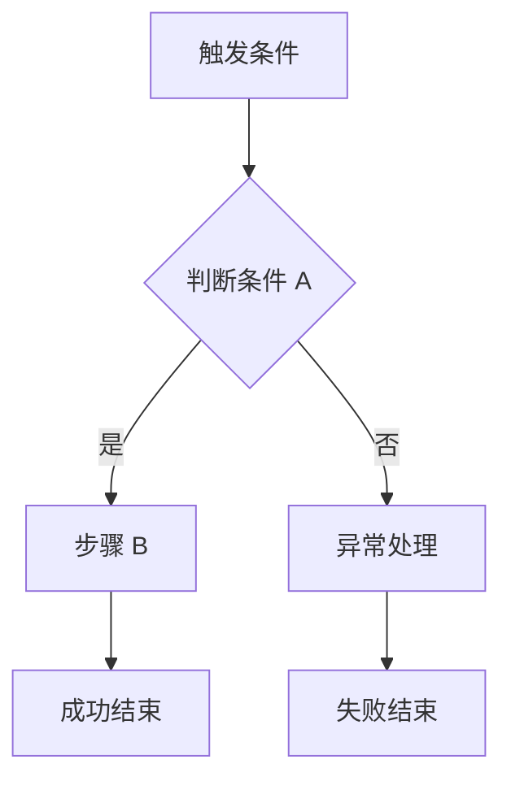
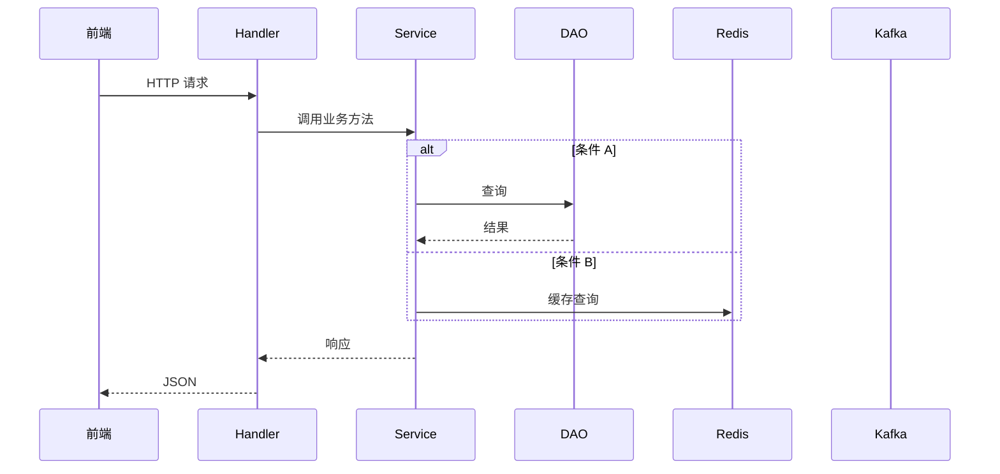
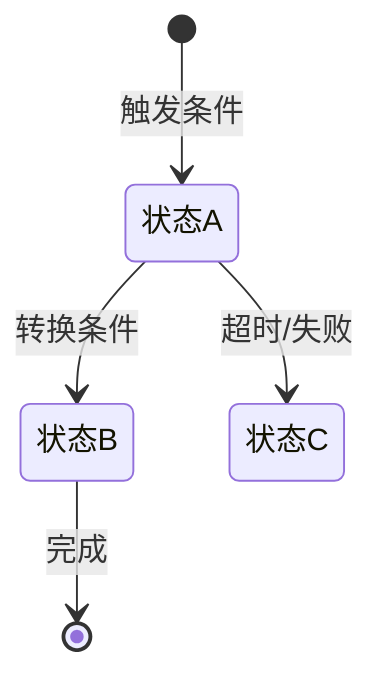

# 技术设计文档模板

> 本模板由 req-to-design skill 在阶段 5 使用。
> 每个 `§` 编号对应 SKILL.md 交叉一致性校验表中的章节引用。
> 标注 `[如不适用，标记"不适用"并说明原因]` 的章节可跳过。
>
> **设计原则：文档中的每一段描述都应精确到可直接翻译为代码，消除代码生成器的猜测空间。**

---

## §0 术语表

> 文档中出现的非通用术语、缩写必须在此定义。

| 术语 | 定义 |
|------|------|
| <!-- 术语/缩写 --> | <!-- 完整含义和业务解释 --> |

---

## §1 概述与背景

**做什么**：<!-- 一段话概括功能目标和核心机制。 -->

**不做什么**：

> **必须同时覆盖业务侧和技术侧。**

- 业务侧：<!-- 逗号分隔的排除项 -->
- 技术侧：<!-- 逗号分隔的排除项 -->

---

## §2 模块目录结构

> **§2 目录结构必须与 §11 代码变更清单中的文件路径完全对齐。**

<!-- 说明模块归属：新建 internal/app/<module> 还是扩展已有模块。 -->

```
internal/app/<module>/
├── provider.go                         # Wire ProviderSet
├── fronthandler.go                     # HTTP handler
├── consts/
│   └── consts.go                       # 常量（Apollo key、错误码、状态值）
├── setting/
│   └── setting.go                      # 配置结构体
├── dto/
│   └── dto.go                          # 请求/响应 DTO 结构体
├── service/
│   ├── common/
│   │   └── xxx.go                      # 共享业务服务
│   ├── consumer/
│   │   └── xxx_handler.go              # MQ 消息处理
│   └── h5/
│       └── activity.go                 # 页面服务
```

<!-- 如涉及 primary/us 构建标签差异，在此说明。 -->

**方案选型**（如有多个可选方案时填写，简单需求可省略）：

| 方案 | 优点 | 缺点 | 结论 |
|------|------|------|------|
| 方案 A | | | 采纳 / 放弃 |
| 方案 B | | | 采纳 / 放弃 |

---

## §3 核心流程设计

> **必须使用 Mermaid 图（flowchart / sequenceDiagram），禁止纯文本缩进的 ASCII 调用链。**
> **流程图中调用的方法名必须与 §5 接口定义中的方法签名对应。**

### 业务流程图

<!-- 每条独立的用户旅程或系统触发链一张 flowchart。命名格式："流程图 N：标题"。 -->

#### 流程图 1：<!-- 标题 -->



### 系统时序图

<!-- 在业务流程图基础上，补充系统层面的 sequenceDiagram，展示 Handler → Service → DAO/Cache/MQ 的交互。
     每条关键链路一张时序图。用 alt/loop/opt 表达条件分支。 -->

#### 时序 1：<!-- 标题 -->



---

## §4 数据模型设计

> **复用已有表必须列出字段清单和本业务的语义映射。**
> **幂等相关的唯一约束必须在此定义（与 §7 对齐）。**
> **新建表必须提供完整 GORM Model struct；复用表必须标注 Model 文件路径和结构体名。**

### 新建表

[如不新建表，标记"不适用"并说明复用哪些表。]

#### 表名：`ca_xxx`

**GORM Model：**

```go
type CaXxx struct {
    ID        int64     `gorm:"column:id;primaryKey;autoIncrement" json:"id"`
    UserID    int64     `gorm:"column:user_id;not null;index:idx_user_campaign" json:"user_id"`
    Status    string    `gorm:"column:status;not null;default:''" json:"status"`
    CreatedAt time.Time `gorm:"column:created_at;not null" json:"created_at"`
    UpdatedAt time.Time `gorm:"column:updated_at;not null" json:"updated_at"`
}

func (CaXxx) TableName() string { return "ca_xxx" }
```

**索引：**

| 索引名 | 字段 | 类型 | 说明 |
|--------|------|------|------|
| `idx_user_campaign` | `user_id, campaign_number` | NORMAL | 用户+活动查询 |
| `uk_xxx` | `field_a, field_b` | UNIQUE | 业务防重（§7 对齐） |

**分表策略：** <!-- 如有 -->

### 复用表（字段语义映射）

> 复用已有表时，必须标注 Model 源文件和结构体名，并列出本业务的语义映射。

#### 表名：`ca_existing_table`

**Model 源文件：** `internal/dao/xxx/xxx_mdl.go` → 结构体 `XxxModel`

表结构（现有，不修改）：

| 字段 | 类型 | 约束 | 说明 |
|------|------|------|------|
| `id` | int64 | PK, auto_increment | 主键 |
| `user_id` | int64 | NOT NULL | 用户 ID |
| `status` | string | NOT NULL | 状态标识 |
| `created_at` | time.Time | NOT NULL | 创建时间 |

本业务语义映射：

| 业务概念 | 字段 | 取值/计算方式 |
|---------|------|-------------|
| <!-- 概念 A --> | `status="xxx"` | <!-- 具体含义 --> |
| <!-- 概念 B --> | `status="yyy"` | <!-- 具体含义 --> |
| <!-- 惰性计算 --> | 查询时判断 | <!-- 计算逻辑 --> |

**状态生命周期：**

> 当数据实体有 2 个以上状态时，必须提供状态机图。



**约束保障：**
- <!-- 去重方式：如何防止重复记录 -->
- <!-- 幂等方式：如何保证操作幂等（与 §7 对齐） -->

### 字段变更

[如不修改字段，标记"不适用"。]

| 表名 | 字段名 | 变更类型 | 类型 | 说明 |
|------|--------|---------|------|------|
| | | 新增 / 修改 | | |

---

## §5 服务层设计

> **复用的现有服务必须包含完整方法签名（参数 + 返回值），不能只写服务名 + 用途。**
> **每个新建服务展示 Go struct（含 Wire 依赖）+ 方法列表 + 关键方法的决策表。**
> **必须标注事务边界。**

### 5.N <!-- 服务名称（职责一句话） -->

```go
type XxxService struct {
    SomeSrv    some.ISomeSRV        // Wire 注入：说明用途
    SomeDAO    *dao.SomeDAO         // Wire 注入：说明用途
    Redis      *xrds.XRDS           // Wire 注入：说明用途
    Config     *setting.Config       // Wire 注入：活动配置
}
```

方法：
- `MethodA(ctx context.Context, userID int64, activityNumber string) (*Result, error)` — 一句话说明
- `MethodB(ctx context.Context, userID int64) (bool, error)` — 一句话说明

**MethodA 决策表：**

> 每步明确正常/异常两条路径，消除 error handling 猜测。

| # | 操作 | 正常 | 异常 | 异常处理 |
|---|------|------|------|---------|
| 1 | 查询 XXX | 返回记录 | nil（不存在） | return nil（忽略） |
| 2 | 校验条件 | 满足 | 不满足 | return ErrXxx |
| 3 | 🔒 TX START | | | |
| 4 | 写入记录 A | 成功 | 失败 | 回滚，return err |
| 5 | 写入记录 B | 成功 | 失败 | 回滚，return err |
| 6 | 🔒 TX END | | | |
| 7 | 发送消息 | 成功 | 失败 | 记日志 WARN，不阻断 |

> `🔒 TX START` / `🔒 TX END` 标记事务边界内的操作。事务内任一步失败整体回滚。

### 复用的现有服务（只读调用）

<!-- 列出本设计中调用的所有已有服务及其具体方法签名。这些服务不需要修改代码。 -->

| 服务接口 | 方法签名 | 用途 |
|----------|---------|------|
| `IAwardSRV` | `SendAward(ctx context.Context, req *SendAwardReq) (*SendAwardResp, error)` | <!-- 用途 --> |
| `userv2.UserService` | `GetNormalUserByUserID(ctx context.Context, userID int64) (*UserInfo, error)` | <!-- 用途 --> |

### 修改现有代码

> **对已有文件的每处修改，必须标注：修改位置（文件+函数/结构体）、当前行为、修改内容、对现有逻辑的影响。**
> **如需在 switch/if 中添加分支，必须展示插入点的上下文代码。**

[如不修改现有代码，标记"不适用"。]

#### 修改点 M1：<!-- 一句话概述 -->

- **文件**：`<!-- 文件路径 -->`
- **位置**：`<!-- 函数名 / 结构体名 / 方法名 -->`
- **当前行为**：<!-- 该函数/代码段现在做什么 -->
- **修改内容**：<!-- 具体改什么 -->

```go
// 修改前（关键上下文）：
func (h *MessageHandle) HandleMessage(ctx context.Context, msg *RealtimeMsg) error {
    switch msg.MsgType {
    case "deposit":
        // 现有逻辑...
    case "register":
        // 现有逻辑...
    // ← 在此处插入新 case
    }
}

// 修改后：
    case "CDC_DEPOSIT_INFO":
        if msg.License == "TBSG" {
            return h.SGDepositHandler.HandleDepositMsg(ctx, msg)
        }
```

- **影响评估**：
  - 现有 case 分支：**无影响**（新增独立 case，不修改已有分支）
  - 消息过滤：前置 License 判断确保仅 TBSG 消息进入，不影响其他牌照
  - 异常隔离：handler 内部 panic 由 `recover` 兜底，不影响同 group 其他消息
  - 性能影响：新增 1 次 switch case 匹配，可忽略

#### 修改点 M2：<!-- 一句话概述 -->

- **文件**：`<!-- 文件路径 -->`
- **位置**：`<!-- 结构体定义 -->`
- **当前行为**：<!-- 当前结构体有哪些字段 -->
- **修改内容**：新增字段用于 Wire 注入

```go
// 修改前：
type FrontHandlers struct {
    ExistingHandler *existing.Handler
    // ← 新增字段
}

// 修改后：
type FrontHandlers struct {
    ExistingHandler *existing.Handler
    SGDepositHandler *sgdepositcampaign.FrontHandler  // 新增
}
```

- **影响评估**：
  - 仅新增 struct 字段，不修改已有字段和方法
  - Wire 自动注入，需 `make gen` 重新生成

### Wire 依赖注入

| 变更类型 | 文件路径 | 说明 |
|----------|---------|------|
| 新增 ProviderSet | `internal/app/<module>/provider.go` | |
| 修改 Wire 入口 | `cmd/campaign/wire.go` | 引入新 ProviderSet |

---

## §6 接口设计

> **每个 API 必须定义 Go DTO 结构体（含 json tag 和 binding 校验规则）。**
> **每个 API 必须提供 Handler 伪代码，展示请求解析→服务调用→响应返回的完整骨架。**

### 6.1 HTTP API

#### `GET /api/v1/<module>/<action>`

**DTO 定义：**

```go
// 请求参数（URL query）
type PageInfoReq struct {
    ActivityNumber string `form:"activity_number" binding:"required"`
}

// 响应
type PageInfoResp struct {
    Status      string  `json:"status"`        // 枚举见下方
    NNF         float64 `json:"nnf"`           // 净新增资金（SGD）
    NextTier    int     `json:"next_tier"`     // 下一档编号，0 表示已达最高
    NextTierGap float64 `json:"next_tier_gap"` // 距下一档差额
    PeriodEndAt int64   `json:"period_end_at"` // 周期结束时间戳(ms)
    CanReEnroll bool    `json:"can_re_enroll"` // 是否可复参
}
```

**`status` 枚举：**
- `not_logged_in` — 未登录
- `no_enrollment` — 无报名记录
- `in_progress` — 活动进行中
- `all_achieved` — 已达最高 Tier
- `period_ended` — 周期已结束

**Handler 伪代码：**

```go
func (h *FrontHandler) GetPageInfo(c *gin.Context) {
    userID := auth.GetUserID(c)                          // 从中间件获取
    var req dto.PageInfoReq
    if err := c.ShouldBindQuery(&req); err != nil {
        xgin.ParamError(c, err)
        return
    }
    resp, err := h.H5Srv.GetPageInfo(c.Request.Context(), userID, req.ActivityNumber)
    if err != nil {
        xgin.Error(c, err)
        return
    }
    xgin.Success(c, resp)
}
```

**响应示例：**

```json
{
  "code": 0,
  "message": "success",
  "data": {
    "status": "in_progress",
    "nnf": 50000.00,
    "next_tier": 3,
    "next_tier_gap": 250000.00,
    "period_end_at": 1759276800000,
    "can_re_enroll": false
  }
}
```

**路由注册位置：** `internal/iface/http/front/` 或 `admin/`

### 6.2 MQ 消费

> **新增 handler 须说明 consumer group 是新建还是复用。**
> **同一 topic+msgType 的现有 handler 列表须列出。**

| Topic | MsgType | Consumer Group | 新建/复用 | Handler | 说明 |
|-------|---------|----------------|----------|---------|------|
| `realtime` | `CDC_DEPOSIT_INFO` | engine | 复用 | `DepositHandler` | |

**同 topic+msgType 的现有 handler：**
- <!-- 列出已有的同类 handler，确认无冲突 -->

**消息过滤条件：**

```go
// 在 consumer handler 入口处过滤
if msg.License != "TBSG" || msg.BehaviorType != "DEPOSIT" {
    return nil // 忽略
}
```

### 6.3 定时任务

[如不适用，标记"不适用"并说明原因]

### 6.4 gRPC

[如不适用，标记"不适用"并说明原因]

---

## §7 并发与一致性

> **声称"唯一键防重"必须在 §4 中有对应的唯一约束。**
> **Redis 锁必须指定 key pattern、TTL、获取失败行为。**

| 场景 | 策略 | Key / 约束 | TTL | 失败行为 |
|------|------|-----------|-----|---------|
| <!-- 并发场景 --> | Redis 分布式锁 | `module:action:{userID}` | 5s | 返回成功（幂等） |
| <!-- 去重场景 --> | DB 查询 | `user_id + campaign_number + status + today 范围` | — | 返回已有记录 |
| <!-- 发奖并发 --> | DB 事务 + 先查后写 | `QueryByUserConfigIds` 存在则跳过 | — | 跳过（幂等） |

---

## §8 错误处理

### 异常场景

| 场景 | 处理方式 |
|------|---------|
| <!-- 外部服务不可用 --> | <!-- 降级/重试/报错 --> |
| <!-- 数据异常 --> | <!-- 处理策略 --> |

### 错误码

> **错误码须声明命名空间/分配范围，说明不与现有模块冲突。**

```go
// consts/consts.go
// 命名空间：6xxxx（本模块专用，已确认与现有模块无冲突）
const (
    MODULE_ACTIVITY_OFFLINE = 60001 // 活动未上线
    MODULE_NOT_ELIGIBLE     = 60002 // 不符合参与条件
    MODULE_COOLDOWN         = 60003 // 冷却期内
    MODULE_SYSTEM_ERROR     = 60099 // 系统错误
)
```

---

## §9 监控与可观测性

[如不适用，标记"不适用"并说明原因]

### 关键日志点

<!-- 使用 xlog.GetLogger(ctx)，自动携带 traceId。 -->

- <!-- 操作名 --> INFO: `userID, activityNumber, result, 耗时`
- <!-- 操作名 --> INFO: `userID, field_a, field_b`
- <!-- 过滤消息 --> DEBUG: `userID, reason`

### Prometheus 指标

| 指标名 | 类型 | 标签 | 说明 |
|--------|------|------|------|
| `module_xxx_total` | Counter | result, reason | <!-- 说明 --> |
| `module_xxx_duration_ms` | Histogram | | <!-- 说明 --> |

### 告警规则

- <!-- 指标条件 --> → WARNING / CRITICAL
- <!-- 指标条件 --> → WARNING / CRITICAL

---

## §10 配置变更

> **每个配置项须有值类型、合法范围、是否支持热更新。**

### Apollo 新增配置

Key: `moduleXxxConfig` (JSON, 热更新)

```go
type ModuleConfig struct {
    CampaignNumber string    `json:"campaign_number"`  // 活动编号，非空
    TaskID         int64     `json:"task_id"`           // 任务 ID，> 0
    AwardConfigIDs []int32   `json:"award_config_ids"`  // 奖励配置 ID 列表
    Enabled        bool      `json:"enabled"`           // 开关，默认 false
}
```

**启动时校验（必须实现）：**

```go
func (c *ModuleConfig) Validate() error {
    if c.CampaignNumber == "" { return errors.New("campaign_number is empty") }
    if c.TaskID <= 0 { return errors.New("task_id must be positive") }
    if len(c.AwardConfigIDs) != 6 { return errors.New("award_config_ids must have 6 elements") }
    return nil
}
// 启动时调用 Validate()，失败则 panic 阻止启动
// 运行时热更新失败记 WARN 日志，保留旧配置
```

---

## §11 代码变更清单

> **文件路径必须与 §2 目录结构完全对齐。**
> **修改操作必须关联 §5「修改现有代码」中的修改点编号（M1、M2...），确保每处修改都有详细描述和影响评估。**

### 新增文件

| # | 文件路径 | 说明 |
|---|---------|------|
| 1 | `internal/app/<module>/provider.go` | Wire ProviderSet |
| 2 | `internal/app/<module>/fronthandler.go` | HTTP handler |
| 3 | `internal/app/<module>/consts/consts.go` | 常量 + 错误码 |
| 4 | `internal/app/<module>/setting/setting.go` | Apollo 配置结构体 + Validate |
| 5 | `internal/app/<module>/dto/dto.go` | 请求/响应 DTO |
| 6 | `internal/app/<module>/service/...` | 业务服务 |

### 修改文件

> 每行必须关联 §5 中的修改点编号，详细修改内容和影响评估见 §5「修改现有代码」对应段落。

| # | 文件路径 | 修改点 | 修改摘要 |
|---|---------|--------|---------|
| 7 | `cmd/campaign/register/allproviders.go` | M2 | AppProviderSet 添加新模块 |
| 8 | `cmd/campaign/register/application_primary.go` | M2 | FrontHandlers 新增字段 |
| 9 | `internal/iface/consumer/message_handle.go` | M1 | HandleMessage 新增 case 分支 |
| 10 | `cmd/campaign/wire.go` | — | 自动生成（make gen） |

### 公共文件影响总览

> 汇总所有修改文件的影响评估（详细分析见 §5 各修改点），用于 Code Review 重点关注。

| 公共文件 | 修改点 | 影响范围 | 风险等级 |
|----------|--------|---------|---------|
| `allproviders.go` | M2 | 仅新增，不影响现有 | LOW |
| `application_primary.go` | M2 | 仅新增字段，不影响现有 | LOW |
| `consumer/message_handle.go` | M1 | 新增 case 分支，需确认隔离性 | MEDIUM |

---

## §12 上线与回滚

### 上线步骤

1. <!-- 前置操作（如运营后台配置） -->
2. <!-- 配置推送（Apollo/Nacos） -->
3. <!-- 代码发布 -->
4. <!-- QA 验证 -->
5. <!-- 开关打开 -->
6. <!-- 监控确认 -->

### 验证 Checklist

> **每项必须有可验证的预期结果（HTTP status、响应体结构、指标名等）。**

| 验证项 | 验证方式 | 预期结果 |
|--------|---------|---------|
| API 可用性 | `curl GET /api/v1/xxx` | HTTP 200, `{"code":0, ...}` |
| 数据写入 | 查询数据库 | 表中存在对应记录 |
| 监控指标 | Grafana 面板 | `module_xxx_total` > 0 |

### 关键测试用例

> 用于驱动单元测试和集成测试代码生成。

| # | 场景 | 前置条件 | 输入 | 预期输出 |
|---|------|---------|------|---------|
| T1 | <!-- 正常路径 --> | <!-- 前置 --> | <!-- 输入 --> | <!-- 预期 --> |
| T2 | <!-- 幂等场景 --> | <!-- 前置 --> | <!-- 输入 --> | <!-- 预期 --> |
| T3 | <!-- 拦截场景 --> | <!-- 前置 --> | <!-- 输入 --> | <!-- 预期 --> |
| T4 | <!-- 异步触发 --> | <!-- 前置 --> | <!-- 输入 --> | <!-- 预期 --> |

### 回滚方案

<!-- 按优先级排列回滚层级。 -->

- **L1 业务关闭**：Apollo enabled=false → 立即生效
- **L2 活动下线**：后台活动状态改 OFFLINE → 双重保险
- **L3 代码回滚**：回滚部署版本 → 已有数据保留

---

## §13 风险与注意事项

### 容量估算

> **须包含预期用户量级、峰值 QPS、存储增量。**

- 目标用户：<!-- 如 日活跃 100-500 人 -->
- 页面 QPS：<!-- 如 峰值 ~50 -->
- 消息 TPS：<!-- 如 峰值 ~10 -->
- 数据增量：<!-- 如 ~1000 条/月 -->

### 风险项

- <!-- 风险描述 --> → <!-- 缓解措施 -->
- <!-- 风险描述 --> → <!-- 缓解措施 -->

### 公共文件影响

> 与 §5「修改现有代码」和 §11「公共文件影响总览」对齐。

- <!-- 文件名 -->（修改点 MN）：<!-- 影响评估 + 风险等级 -->

### 待确认事项

- [ ] <!-- 需要与产品/其他团队确认的开放问题 -->
