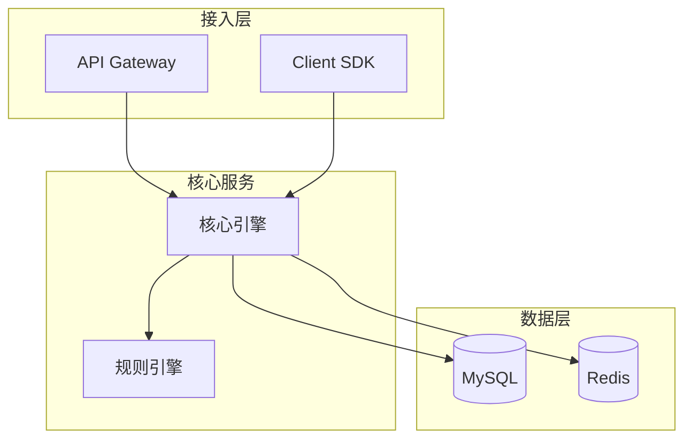
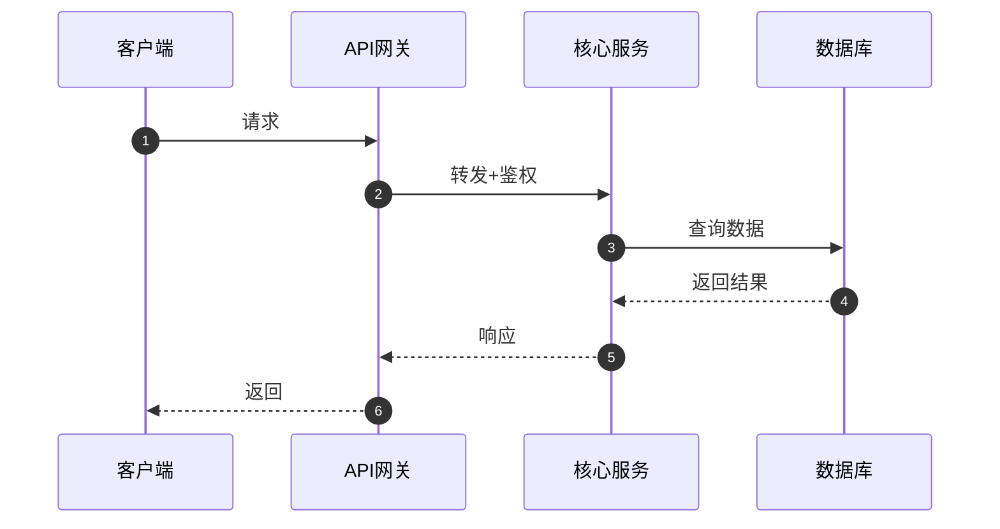
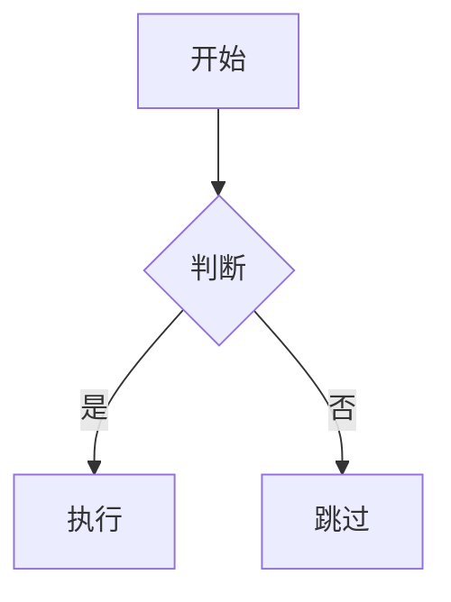

# 技术文档写作指南

> 本指南从 5 篇公司内部优秀技术方案文档中提炼而来，涵盖结构模型、写作手法、呈现技巧和常见陷阱。

---

## 一、文档结构模型库

根据方案类型选择最匹配的结构模型：

### 模型 A：平台建设型（适用于从 0 到 1 建设公司级平台）
```
概览 → 为什么做（痛点+目标+业界对标） → 做什么（分期能力）
→ 怎么做（架构+核心模块+选型） → 怎么保障（权限+安全+监控）
→ 怎么运行（部署+运维） → 什么时候做（排期）
```
**典型案例**：统一核对平台、AI 平台 Aivolution
**必备章节**：痛点表、目标量化表、业界对标对比表、一期/二期规划表、技术选型对比表

### 模型 B：业务逻辑收口型（适用于分散逻辑统一治理）
```
事故/问题驱动 → 场景梳理 → 逻辑定义（含 Q&A 论证）
→ 方案设计 → 技术选型 → 稳定性保障 → 上线里程碑
```
**典型案例**：用户是否可营销逻辑收口
**必备章节**：业务场景分类梳理、逻辑的形式化定义、Q&A 决策论证、灰度方案、QPS 按调用方拆分

### 模型 C：高可用/降级容灾型（适用于故障降级、多源热备）
```
一句话概括 → 背景目标（含术语表） → 方案设计 + 场景推演
→ 稳定性评估（各侧影响百分比） → 运维方案（上线+回滚）
```
**典型案例**：行情交易降级方案
**必备章节**：术语表、场景推演时间线表、关键问题 Q&A、影响百分比评估、极简回滚方案

### 模型 D：基础设施组件型（适用于网关、中间件、基础服务）
```
用户痛点引入 → 概念辨析（新组件 vs 传统方案） → 方案设计（多子模块）
→ 稳定性（优雅停机+压测+监控） → 项目计划
```
**典型案例**：Aivolution 模型网关
**必备章节**：新旧概念差异对比表、开源方案选型对比表、接口设计+示例、异常/错误码统一表、权限方案多维度对比

---

## 二、写作手法精粹

### 手法 1：开篇定调的 4 种方式

| 方式 | 适用场景 | 示例 |
|------|----------|------|
| 事故/问题驱动 | 有真实业务事故 | "最近2个月又发生3次+营销FA客户的case" |
| 用户真实问题 | 解决用户频繁提问的问题 | 列出5个真实的用户提问，提炼核心现状 |
| 痛点表格 | 多团队有共同痛点 | 6行痛点表（痛点类别/具体表现/涉及团队） |
| 一句话概括 | 方案目标明确 | "本方案通过XXX机制，实现YYY目标" |

### 手法 2：选型论证的标准范式
```
多方案横向对比表（N个维度 × M个候选方案）
  ↓
明确选型结论（加粗/高亮/emoji标记）
  ↓
选择理由（3-5条编号列表）
  ↓
落选方案的原因（1-2句话）
  ↓
使用示例（代码/配置/curl命令）
```

### 手法 3：Q&A 预答评审疑问
用 callout 高亮框呈现 Q&A：
```html
<callout emoji="💡" background-color="light-orange">
Q1：本方案是否可以解决所有防误触问题？
</callout>
A1：我们认为本方案的定位不是去解决所有问题，而是解决当前能够有明确解决方案的90%的问题...
```
覆盖的典型问题类型：
- 方案边界和局限性
- 时效性/性能要求
- 收口/归属决策
- 未来兼容性
- 对已有系统的影响
- 可靠性和降级

### 手法 4：场景推演（高可用方案必备）
用时间线表格推演故障场景：

| 步骤 | 事件 | 切换时长 | 业务影响 |
|------|------|----------|----------|
| 1 | 正常状态，系统消费主源数据 | - | - |
| 2 | 主源故障，自动切换到备源 | 自动、近乎实时 | - |
| 3 | 行情侧恢复，切换到实时数据 | 2-3min | 使用延迟数据 |
| 4 | 系统恢复使用主源实时数据 | - | 恢复正常 |

### 手法 5：性能指标的推导式表达
不要：`RPM: 720`
要：`RPM: 720 — 过去30天请求约81万次，平均每天27000次，按二八定律估算峰值QPS为1.25，以当前峰值*10预估`

### 手法 6：核心原则先行
每个设计模块开头用加粗句子声明核心设计原则：
- **核心原则：不存储业务数据，只做实时读取/缓存**
- **核心原则：默认同步DBA平台权限，跨组访问需单独申请**
- **核心原则：降级严格区分三方模型和私部模型，不能互跨**

### 手法 7：分步决策
复杂决策拆成多步，每步独立论证：
- 第一步：云部署 vs 机房部署（对比表 → 选择云部署）
- 第二步：哪个云厂商（评估维度 → 选择方案 + 参数化结论）

### 手法 8：结论的参数化表达
选型结论不要模糊，要用具体参数表达：
```
- 部署地：新加坡
- 部署模型：deepseek-r1-671B
- 部署规模：H200 × 2
- 吞吐能力：并发数 = 70 & 每分钟输出token = 79,800
```

---

## 三、必备图表类型

### 架构图（mermaid flowchart）

**要求**：节点命名有业务语义，分层清晰，图后附关键组件说明列表。

### 时序图（mermaid sequenceDiagram）

**要求**：participant 使用中文别名，关键步骤加 Note 说明。

### 流程图（mermaid flowchart LR）
适用于数据处理流水线、审批流程等。

### 状态机图（mermaid stateDiagram-v2）
适用于有状态流转的场景（如健康检查状态、订单状态等）。

---

## 四、表格使用规范

### 对比选型表
- 行：对比维度（6-10 个）
- 列：候选方案（2-4 个）+ 可选"本方案定位"列
- 关键差异用加粗标注
- 表后给结论 + 理由列表

### 目标量化表
| 目标 | 现状值 | 目标值 | 验证时间 | 验证方式 |
|------|--------|--------|----------|----------|
| 主目标 | 具体数字 | 具体数字 | 上线后X月 | 具体验证方法 |

### 监控指标表
按 3 层分类：业务指标 / 技术指标 / 系统资源指标
每条指标要有说明列解释含义。

### 应急预案 SOP 表
| 预案 | 服务 | 核心操作 | 执行耗时 | 恢复机制 | 风险等级 |
|------|------|----------|----------|----------|----------|

### 限流策略表
按维度递进：全局限流 → 调用方限流 → 上下游双向限流

### 里程碑表
| 阶段 | 计划周期 | 核心目标 | 交付物 | 人力(人日) |
|------|----------|----------|--------|-----------|

---

## 五、飞书语法速查

### 高亮块
```html
<callout emoji="💡" background-color="light-blue">提示信息</callout>
<callout emoji="⚠️" background-color="light-yellow">警告信息</callout>
<callout emoji="❌" background-color="light-red">危险提示</callout>
<callout emoji="✅" background-color="light-green">成功提示</callout>
```

### 分栏
```html
<grid cols="2">
<column width="50">左侧内容</column>
<column width="50">右侧内容</column>
</grid>
```

### 文字颜色/高亮
```html
<text color="red">重要结论</text>
<text bgcolor="light-yellow">待确认项</text>
```

### 引用容器
```html
<quote-container>补充说明或注意事项</quote-container>
```

### 画板替代方案
飞书不支持直接写 `<whiteboard>`，使用 mermaid 代码块替代：
````

````

---

## 六、常见陷阱

| 陷阱 | 正确做法 |
|------|----------|
| 目标写"提升效率" | 写"新业务接入从3个工作日降至30分钟" |
| 选型只给结论没有对比 | 必须有对比表 + 理由 + 落选原因 |
| 全是文字没有图 | 每篇至少1张架构图 + 相关流程图 |
| QPS 拍脑袋 | 按调用方拆分，给出推导过程 |
| 安全散落各处 | 稳定性/安全独立成章 |
| 方案没有回滚计划 | 必须包含回滚方案，最好是"一个开关"级别 |
| 缺少术语表 | 涉及专业术语时必须有术语表 |
| 没有预答评审问题 | 复杂决策用 Q&A callout 预先论证 |
| 大段描述替代方案 | 用表格做横向对比 |
| 正文首标题重复文档标题 | 飞书会自动显示标题，正文不要重复 |

---

## 七、质量自检清单

生成文档后，按以下清单自检：

- [ ] 有方案简述（一段话或一句话概括）？
- [ ] 有痛点/背景（表格或事故描述）？
- [ ] 有量化目标（现状值→目标值→验证方式）？
- [ ] 有整体架构图（mermaid）？
- [ ] 有技术选型对比表？
- [ ] 有核心流程/时序图？
- [ ] 有监控指标表？
- [ ] 有稳定性独立章节（权限+安全+降级+限流）？
- [ ] 有运维方案（部署+回滚）？
- [ ] 有排期/里程碑？
- [ ] 所有对比信息都用表格呈现？
- [ ] 性能指标有推导过程？
- [ ] 正文首标题没有重复文档标题？
- [ ] 敏感/详细内容已外链化？
